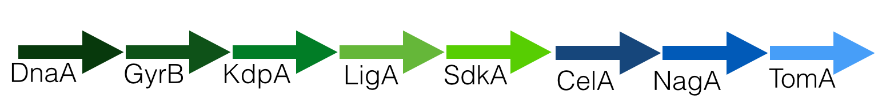

MLST-ID for *Clavibacter*
========================================================

Using the packages `ape, phangorn, and poppr` we developed a genotype identification tool for *Clavibacter* populations. The regions we obtained (in `FASTA` format) are divided in two:

1. Housekeeping Genes
  * DnaA
  * GyrB
  * KdpA
  * LigA
  * SdhA
2. Virulence Genes
  * CelA
  * NagA
  * TomA
  
This **genotyping webapp** permits the identification of a query strain with **any of the mentioned loci or a concatenated matrix of the housekeeping genes, virulence genes or both datasets**.

How to run MLST-ID?
------

1. **Select** the **Loci database** of interest
2. Copy and paste the **FASTA** query to the box (You can use Notepad, Textedit or Textwrangler to open FASTA files)
3. Select one of the **genetic distances** (read [the ape page on distances](http://www.inside-r.org/packages/cran/ape/docs/dist.dna) for more information) and set a **seed** value (any number).
4. Select the **type of analysis** and the number of boostraps.
5. Instant profit.

How to use a concatenated database?
-------

MLST-ID for *Clavibacter* uses single gene information as mentioned before, but also has the capacity to use a concatenated matrix of **housekeeping genes**, **virulence genes** and **All genes**. To concatenate use software as Geneious or Mesquite to concatenate the sequences in said order.
### Housekeeping gene order:

### Virulence gene order:
**Disclaimer:** Samples **09085, 0317, 10-4R, 12084** are removed from the dataset since some of the genes are not avaiable for said samples.

### Complete dataset (All):
**Disclaimer:** Samples **09085, 0317, 10-4R, 12084** are removed from the dataset since some of the genes are not avaiable for said samples.

After obtaining the concatenated matrix, 